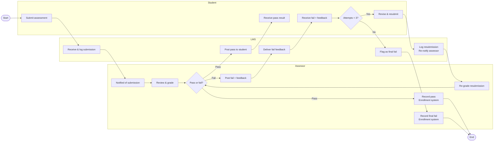

```mermaid
flowchart LR
    START([Start])

    subgraph Student
        ST1[Submit assessment]
        ST2[Receive pass result]
        ST3[Receive fail + feedback]
        ST4{Attempts < 3?}
        ST5[Revise & resubmit]
    end

    subgraph LMS
        LM1[Receive & log submission]
        LM2[Post pass to student]
        LM3[Deliver fail feedback]
        LM4[Log resubmission\nRe-notify assessor]
        LM5[Flag as final fail]
    end

    subgraph Assessor
        AS1[Notified of submission]
        AS2[Review & grade]
        AS3{"Pass or fail?"}
        AS4[Post fail + feedback]
        AS5[Re-grade resubmission]
        AS6[Record pass\nEnrollment system]
        AS7[Record final fail\nEnrollment system]
    end

    END([End])

    START --> ST1
    ST1 --> LM1
    LM1 --> AS1
    AS1 --> AS2
    AS2 --> AS3

    AS3 -- Pass --> LM2
    LM2 --> ST2
    AS3 -- Pass --> AS6
    AS6 --> END

    AS3 -- Fail --> AS4
    AS4 --> LM3
    LM3 --> ST3
    ST3 --> ST4

    ST4 -- Yes --> ST5
    ST5 --> LM4
    LM4 --> AS5
    AS5 --> AS3

    ST4 -- No --> LM5
    LM5 --> AS7
    AS7 --> END
```
